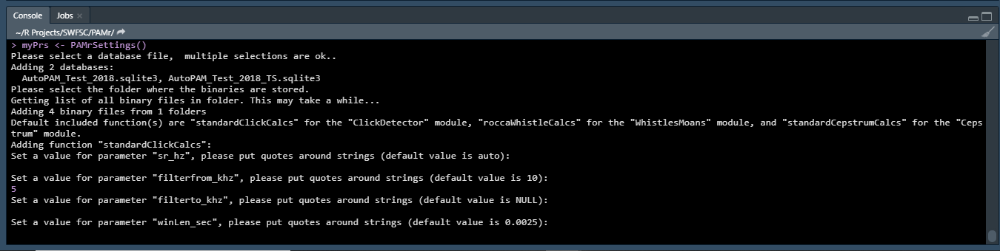

# PAMr

This is a package for processing passive acoustic data. Currently only supports
data collected using [Pamguard](https://www.pamguard.org/), but in the future
we hope to support other platforms. 

Note that this is currently a beta version, so some bugs and quirks are expected.
Hopefully this guide will work you through the most common pitfalls, but please
report any other issues to [taiki.sakai@noaa.gov](mailto:taiki.sakai@noaa.gov).

Our goal is to make your life easier, so if you have any other suggestions or 
feedback feel free to pass that along as well!

### Installation

To install the latest version from GitHub, first make sure that you have
[Rtools](https://cran.r-project.org/bin/windows/Rtools/) installed, then 
run the following code to install PAMr and two supporting packages, PamBinaries
and PAMmisc. Currently it is important to install PamBinaries and PAMmisc first,
but this won't matter once the package is on CRAN (Est. Q1 2020).

```r
# make sure you have Rtools installed
if(!require('devtools')) install.packages('devtools')
# you will also need these packages from GitHub
devtools::install_github('TaikiSan21/PamBinaries')
devtools::install_github('TaikiSan21/PAMmisc')
# install from GitHub
devtools::install_github('TaikiSan21/PAMr')
```

#### Common Installation Issues

* If you are getting errors related to "Unable to unload package ______", try
opening a fresh R session, or installing the package from the R console instead
of RStudio

* If you see an error like `Error in strptime(xx, f, tz = tz) : unable to identify current timezone 'C'`,
then run the code `Sys.setenv(TZ = 'UTC')` and try again. This is common on field laptops, or laptops
where the timezone has been set manually to something other than the local timezone. 

* If you see an error like 
`Error: Failed to install 'PAMr' from GitHub: installationg of package 'ProblemPackage' had non-zero exit status`,
try installing the package "ProblemPackage" separately. PAMr relies on quite a few other packages, if any of them
fail to install properly then PAMr will not install. Sometimes a package will request to be "Installed from
source", try both options if it fails to install.

### Quick Start Guide

PAMr is currently only built to work with [Pamguard](https://www.pamguard.org/),
and is built to organize your acoustic detections into events. Before getting
started you'll need to have three things:
1) The database (or multiple) created by Pamguard
2) The folder containing containing the binary files (xxx.pgdf) created by Pamguard
3) A way of organizing your data into events, either using Pamguard's event or 
Detection Group Localizer modules, or by specifying start and end times (see
[guide](time-grouping) for details on how to do this)

Once you have these ready, the first step to using PAMr is to create a
PAMrSettings object using the `PAMrSettings()` function. You can call this 
function with no arguments and pop-up menus will walk you through the rest:

```r
myPrs <- PAMrSettings()
```
First you will be asked to select the database files. You can select more than one
using CTRL or SHIFT. Don't worry - you can add or remove databases later, nothing
here is final.


Next you will be asked to select a folder containing the binary files. You can
just select the highest level folder and PAMr will search through all the 
sub-folders for any .pgdf files (ie. it is okay to select "Binaries" instead of
"20040828" in the image below).


NOTE: Sometimes the selection windows don't pop up in front of your R session,
if you don't immediately see the file selection window for either of these two
steps then look for it with ALT+TAB.

Next you will be asked to set some parameters for the processing functions that
come with PAMr. There is one function for each of three types of detections -
clicks, whistles, and cepstrum detections. See [here](standard-calcs) for more
information.

The only function you need to set parameters for is the "standardClickCalcs"
function. You can either enter a new value for the parameter it is asking you
to set, or just pressing ENTER will use the default value (the default value is
shown. There are three parameters you will be asked to set 
(more details found [here](standard-calcs)):
1) "sr_hz" - the sample rate in hertz for the click data. This should be kept 
to the default value of "auto" (just press ENTER) unless your click data was
decimated, in which case enter the decimated sample rate.
2) "highpass_khz" - the value in kilohertz of the butterworth highpass filter
to apply to the click data. If 0, then no filter will be applied.
3) "winLen_sec" - the length of the FFT window to use for analysis, in seconds



NOTE: You will need to enter these values in the R Console, so if you are running
`PAMrSettings()` from a script you need to either click in the console before typing
or use the shortcut CTRL+2

A quick start guide - show me your data, accept the basics, look at what we did.
A plot explorer and plot waveform example or a banter example?

Then more details about your PRS - adding, customizing, what it has

PAMr works by grouping acoustic detections into events. Either in Pamguard or
by start/end times. 
Here s a picture 

andnanother


### Next sections

PRS details - adding and removing stuff
Adding GPS data
Adding calibration function for clicks
Creating custom functions
Accessing your data - $, getDetectorData
Study/Event details
Collaboration
Future plans
### Tutorial

The first step in using PAMr is to create a PAMrSettings object. This is an
S4 class created for this package, and will store all settings related to a
particular anaylsis. The goal of this object is to make it easy to share and
replicate results between users. 

A PAMrSettings object has four slots:

* db - This stores the full path to any SQLite databases that will be analysed
* binaries - This stores the folder names of any binaries, as well as the full
path to all individual Pamguard binary (.pgdf) files within those folders
* functions - This stores a set of functions that will be applied to the data 
when read in from the database/binary files. Stores functions for the 
'ClickDetector' and 'WhistlesMoans' modules separately. When adding a new 
function, users are asked to supply values for any arguments of the function.
These values are saved with the function and cannot be changed without removing
the function entirely. 
* calibration - Currently does nothing, in later versions will store calibration
functions to apply to data before making any calculations.

#### Getting Started 

A new PAMrSettings (PRS) object can be created interactively by simply calling the
function `PAMrSettings()`:

```r
myPrs <- PAMrSettings()
```

*** Note that only Click and WhistlesMoans binaries will be added ***

This will ask the user to select a database file, then select a folder of binaries,
and then ask for parameters for the included `standardClickCalcs` function. In
future versions there may be more "standard" functions included. If you do not
have a database or binary folder, hitting "Cancel" on the selection window will
still create the PAMrSettings object, just without those files.

A PAMrSettings object can also be created by directly supplying the database and binary
file paths, although the user will still be asked to input parameters for the 
`standardClickCalcs` function.

```r
myDb <- './Data/TestDB.sqlite3'
myBinaryFolder <- './Data/Binaries'
myPrs <- PAMrSettings(db = myDb, binaries = myBinaryFolder)
```

#### Processing Data

Once you have a PRS object, processing your data is easy. There are three ways
to do this, specified using the `mode` argument of `getPgDetections`. Mode `db`
just requires the PRS as input, and will load all of the data found
in the `db` slot of your PRS object. It will group these detections into events
based on either the Detection Group Localiser module, or the Click Event module.
All functions in the `functions` slot of the PRS will be applied to the appropriate
module type, and the results will get stored as a dataframe. Mode `all`
requires the PRS and the sample rate of your data as inputs (normally this is read
from a database), then applies all the calculations to every detection in every binary
file. Mode `time` requires a dataframe or csv file specifying the start and end times
of events as well as an event id and optionally a species id. See `?getPgDetections` for
more info on this mode.

```r
myDataDb <- getPgDetections(myPrs, mode='db')
myDataAll <- getPgDetections(myPrs, mode='all', sampleRate=192000)
myDataTimes <- getPgDetections(myPrs, mode='time', sampleRate=192e3, grouping='myEvents.csv')
```

#### Adding to Your PRS

After the initial set-up of your PRS, you may want to add to it. There are 
three functions that accomplish this: `addDatabase`, `addBinaries`, and
`addFunction`. The first two are simple, and can be called interactively
just like the initial PRS setup or by providing the paths.

```r
myPrs <- addDatabase(myPrs)
myPrs <- addBinaries(myPrs)
newDb <- './Data/NewDB.sqlite3'
newBinaries <- './Data/NewBinaries/'
myPrs <- addDatabase(myPrs, newDb)
myPrs <- addBinaries(myPrs, newBinaries)
```

Adding a function is slightly more involved. First make sure the function (or
the package the function is in) is already sourced. Then add the function by
name, also specifying the module as either 'ClickDetector' or 'WhistlesMoans'.
If you do not specify, you will be asked to choose. `addFunction` will also
ask the use to set the value for any parameters that are arguments to the
function you provide, except for parameters named "data" or "calibration".
In this example, the user would be ask to set values for "a", then "b", and
would be told that the default for "a" is 1, and that there is not a default
value for "b".

```r
testFunction <- function(data, a=1, b) {
    ### Do smart stuff here
}
myPrs <- addFunction(myPrs, testFunction, module='ClickDetector')    
```

For the ClickDetector, there are a couple of requirements for this function. 
The function should have an input called "data", and it should expect that 
this "data" input is a list with two parts: `data$wave` containing the click 
waveform, and `data$sampleRate` containing the sample rate of this click. The
waveform will have one column for each channel. The output of this function
should be a dataframe that has one row for each channel, there can be as many 
columns as you like. `addFunction` will do a quick check of the function you
try to add on a sample click.

For WhistlesMoans functions, the function should have an input "data" that is
a list with two parts: `data$freq` and `data$time`. `freq` should contain the
contour of the whistle, stored as a vector of frequencies. `time` should be
the time in seconds at each of these frequencies. The output of this function
should be a dataframe with one row, or an object that is easily coerced to a
dataframe (e.g. a list where all elements have length 1). 

Functions can also be added from a separate PRS object by passing the other
PRS object in as the second input. In this case all functions from the second
PRS object (`newPrs` below) will be added to your PRS. This can be useful when
collaborating with others. Someone can send you their PRS file with their functions
and settings, but the paths to the data will not match up on your computer. You
can use this method to add their calculations to your PRS file that points to your
data.

```r
newPrs <- myPrs
myPrs <- addFunction(myPrs, newPrs)
```

#### Calibration

*under construction*

!!IMPORTANT!! If you are adding your own functions to a PRS object and you make
a change to your function and source it again, the function *will not be changed*
in the existing PRS object. You must remove the function and add it again, bringing
us to the next section...

#### Removing Things From Your PRS

There are three functions that remove items from your PRS, and it is recommended
that you use this instead of trying to alter the PRS manually. All of them can
be called interactively and provide menus for the user to select the item to 
remove. See the help pages for more info.

```r
myPrs <- removeDatabase(myPrs)
myPrs <- removeBinaries(myPrs)
myPrs <- removeFunction(myPrs)
```

### Versions

For bug fixes and feature additions in each version see the [NEWS](NEWS.md) file
